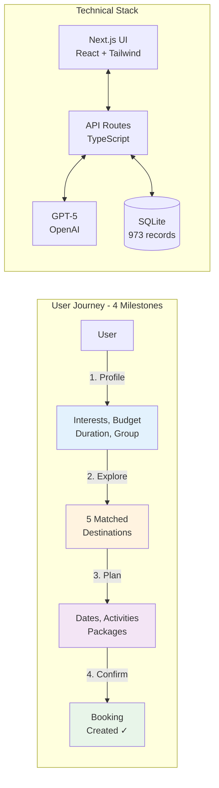
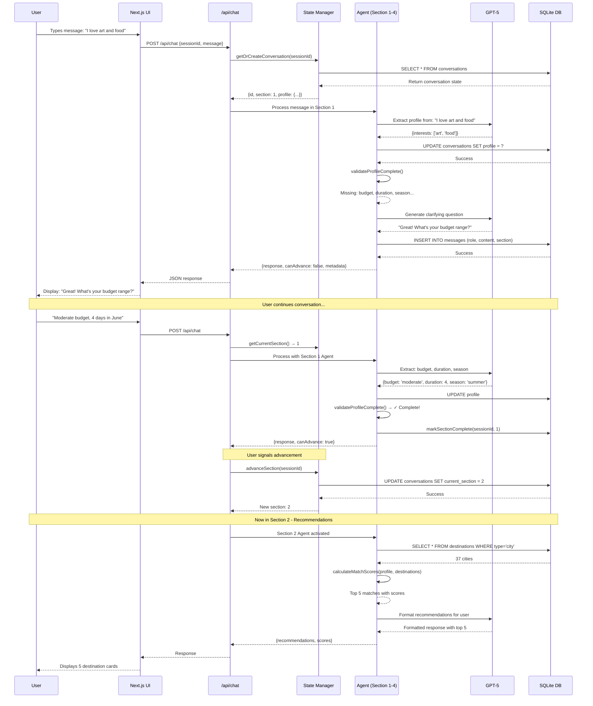

# Architecture Overview - Quick Reference

## 📊 High-Level System View



## 🏗️ Architecture Layers

### 1️⃣ Frontend (Next.js + React)
```
┌─────────────────────────────────────┐
│   📱 User Interface Components      │
├─────────────────────────────────────┤
│ • Chat Interface (Messages)         │
│ • Progress Bar (Section 1-4)        │
│ • Recommendation Cards              │
│ • Booking Summary                   │
└─────────────────────────────────────┘
         ↕ HTTP/JSON
```

### 2️⃣ API Layer (Next.js Routes)
```
┌─────────────────────────────────────┐
│   🔌 API Endpoints                  │
├─────────────────────────────────────┤
│ • POST /api/chat                    │
│   → Main conversational interface   │
│                                     │
│ • GET /api/recommendations          │
│   → Fetch matched destinations      │
│                                     │
│ • POST/GET /api/session             │
│   → Session management              │
│                                     │
│ • POST /api/suggestions             │
│   → Dynamic context suggestions     │
└─────────────────────────────────────┘
         ↕ Function Calls
```

### 3️⃣ Business Logic (Agents)
```
┌─────────────────────────────────────┐
│   🤖 AI Agent Orchestrator          │
├─────────────────────────────────────┤
│                                     │
│  Section 1 Agent                    │
│  ├─ Extract profile from NL         │
│  ├─ Validate completeness           │
│  └─ Generate questions              │
│                                     │
│  Section 2 Agent                    │
│  ├─ Match destinations (scoring)    │
│  ├─ Answer exploration questions    │
│  └─ Detect selection intent         │
│                                     │
│  Section 3 Agent                    │
│  ├─ Collect dates/times             │
│  ├─ Suggest packages/activities     │
│  └─ Validate budget                 │
│                                     │
│  Section 4 Agent                    │
│  ├─ Generate summary                │
│  ├─ Collect contact info            │
│  └─ Create booking                  │
│                                     │
└─────────────────────────────────────┘
         ↕ API Calls
```

### 4️⃣ AI Layer (OpenAI GPT-5)
```
┌─────────────────────────────────────┐
│   🧠 Large Language Model           │
├─────────────────────────────────────┤
│ • Natural Language Understanding    │
│ • Structured Data Extraction        │
│ • Conversational Response Gen       │
│ • Intent Detection                  │
└─────────────────────────────────────┘
         ↕ SQL Queries
```

### 5️⃣ Data Layer (SQLite)
```
┌─────────────────────────────────────┐
│   💾 SQLite Database (973 records)  │
├─────────────────────────────────────┤
│ conversations       (session state) │
│ messages           (chat history)   │
│ destinations       (37 cities)      │
│ attractions        (320 items)      │
│ activities         (320 items)      │
│ packages           (56 bundles)     │
│ restaurants        (240 options)    │
│ bookings           (confirmations)  │
└─────────────────────────────────────┘
```

---

## 🔄 Data Flow Diagram



---

## 📋 Section Milestone Checklist

### Section 1: Profile Gathering
```
Required Fields:
☐ Interests (1+ from 8 options)
☐ Budget (budget/moderate/luxury)
☐ Group type (solo/couple/family/group)
☐ Group size (1-20)
☐ Duration (2-30 days)
☐ Travel season (spring/summer/fall/winter)
☐ Pace (relaxed/moderate/fast)
☐ Weather preference (warm/mild/cool/any)

Advancement Trigger: All fields complete + user intent
```

### Section 2: Destination Selection
```
Process:
☐ Generate top 5 recommendations
☐ Calculate match scores (Interest 40%, Budget 25%, Season 15%, Pace 20%)
☐ Display with reasons
☐ Allow exploration (Q&A)
☐ Detect selection intent

Advancement Trigger: Destination explicitly selected
```

### Section 3: Trip Finalization
```
Required Information:
☐ Exact start date (future)
☐ Exact end date (after start)
☐ Arrival time slot
☐ Departure time slot
☐ Package OR custom accommodation
☐ Activities (min 1)
☐ Attractions (min 2)
☐ Special requests (optional)

Advancement Trigger: All required fields + user readiness
```

### Section 4: Review & Confirmation
```
Process:
☐ Generate complete summary
☐ Collect email (validated)
☐ Collect phone (validated)
☐ Display final confirmation prompt
☐ User explicitly confirms

Completion: Booking created, confirmation email sent
```

---

## 🎯 Key Algorithms

### Recommendation Scoring Algorithm
```typescript
function calculateDestinationScore(profile, destination) {
  let score = 0;
  
  // 1. Interest Match (40%)
  const interestScore = averageInterestScore(profile.interests, destination);
  score += interestScore * 0.4;
  
  // 2. Budget Fit (25%)
  if (destination.budget_tier === profile.budget) {
    score += 25;
  } else if (withinOneTier(destination.budget_tier, profile.budget)) {
    score += 15;
  }
  
  // 3. Season Match (15%)
  if (destination.best_seasons.includes(profile.travel_season)) {
    score += 15;
  }
  
  // 4. Pace Alignment (20%)
  const paceScore = destination[`pace_${profile.pace}`]; // 0-100
  score += (paceScore / 100) * 20;
  
  return Math.min(score, 100);
}
```

### Profile Extraction (GPT-5)
```typescript
// System prompt for structured extraction
const prompt = `
Extract travel preferences from user message.
Return JSON with these fields (if mentioned):
- interests: array of ["art", "food", "nature"...]
- budget: "budget" | "moderate" | "luxury"
- group_type: "solo" | "couple" | "family" | "group"
- duration_days: number
- travel_season: "spring" | "summer" | "fall" | "winter"
- pace: "relaxed" | "moderate" | "fast"
- weather_pref: "warm" | "mild" | "cool" | "any"
`;

const response = await openai.responses.create({
  model: "gpt-5",
  input: `${prompt}\n\nUser: ${message}`,
  reasoning: { effort: "medium" }
});

const extracted = JSON.parse(response.output_text);
```

---

## 🚀 Deployment Architecture

### Development
```
Local Machine
├─ Next.js Dev Server (localhost:3000)
├─ SQLite DB (./data/database.db)
└─ Environment Variables (.env.local)
```

### Production (Vercel)
```
Vercel Edge Network
├─ Next.js Application (Serverless)
├─ API Routes (Lambda Functions)
├─ Static Assets (CDN)
└─ SQLite → Turso (Hosted SQLite)
    └─ Global replication
    └─ Auto-scaling
```

---

## 📊 Database Schema Summary

```sql
-- Core session tracking
conversations (
  id, session_id, current_section,
  profile, selected_destination_id,
  trip_details, contact_info, status
)

-- Message history
messages (
  id, conversation_id, role,
  content, section, metadata
)

-- Travel content (read-mostly)
destinations (37 cities with interest scores)
attractions (320 items)
activities (320 items)
packages (56 bundles)
restaurants (240 options)

-- Bookings
bookings (
  confirmation_number, destination_id,
  dates, travelers, total_price, status
)
```

---

## 🔐 Key Technologies

| Component | Technology | Purpose |
|-----------|-----------|---------|
| **Frontend** | Next.js 14 + React | Server-side rendering, routing |
| **Styling** | TailwindCSS | Responsive, utility-first CSS |
| **Backend** | Next.js API Routes | RESTful endpoints |
| **Database** | SQLite + better-sqlite3 | Local-first data storage |
| **AI** | OpenAI GPT-5 | Natural language understanding |
| **Session** | iron-session | Secure session management |
| **Validation** | Zod | Schema validation |
| **Deployment** | Vercel | Edge network, serverless |

---

## 📈 Performance Targets

| Metric | Target | Current |
|--------|--------|---------|
| API Response Time (P95) | < 2s | TBD |
| Page Load (Initial) | < 1s | TBD |
| LLM Response Time | < 3s | TBD |
| Database Query Time | < 100ms | ✓ |
| Section Completion Rate | > 90% | TBD |
| End-to-End Booking Time | < 15min | TBD |

---

## 🎨 UI Component Tree

```
App (layout.tsx)
└── Page (page.tsx)
    ├── Header
    │   ├── Logo
    │   └── Navigation
    │
    ├── ProgressTracker
    │   ├── SectionIndicator (1-4)
    │   ├── ProgressBar
    │   └── CompletionPercentage
    │
    ├── ChatInterface
    │   ├── MessageList
    │   │   ├── UserMessage[]
    │   │   └── AgentMessage[]
    │   │
    │   ├── TypingIndicator
    │   └── MessageInput
    │       ├── TextArea
    │       └── SendButton
    │
    ├── RecommendationCards (Section 2)
    │   └── DestinationCard[]
    │       ├── Image
    │       ├── Name & Score
    │       ├── Description
    │       └── SelectButton
    │
    ├── TripSummary (Section 4)
    │   ├── DestinationInfo
    │   ├── DateInfo
    │   ├── ActivityList
    │   ├── PriceBreakdown
    │   └── ConfirmButton
    │
    └── Footer
```

---

## 🔄 State Management Flow

```
User Action
    ↓
React Component
    ↓
API Call (/api/chat)
    ↓
State Manager
    ├─ Get current section from DB
    ├─ Load conversation history
    └─ Route to appropriate agent
        ↓
Section Agent (1-4)
    ├─ Call GPT-5 for NL processing
    ├─ Extract/validate data
    ├─ Update database
    └─ Generate response
        ↓
State Manager
    ├─ Check milestone completion
    ├─ Advance section if ready
    └─ Log message
        ↓
API Response
    ↓
React Component Update
    ↓
UI Renders New State
```

---

## 📝 Example User Journey Timeline

```
0:00 - User lands on site
0:05 - "I want art and food in Europe"
0:10 - Agent asks about budget
0:20 - User provides full profile
0:25 - Section 1 Complete ✓
0:30 - Agent shows 5 destinations
0:45 - User asks about Amsterdam
1:00 - "Tell me about hotels"
1:15 - "Book Amsterdam" → Section 2 Complete ✓
1:20 - Agent asks for dates
1:30 - "June 15-19"
1:45 - Shows packages
2:00 - Selects cultural package
2:10 - Section 3 Complete ✓
2:15 - Reviews summary
2:25 - Provides email/phone
2:35 - Confirms booking
2:40 - Section 4 Complete ✓
     → Booking Created: VIK-2025-123456
```

**Total Time**: ~2-3 minutes for happy path (quick booker)
**Average Time**: ~12-15 minutes (exploratory user)

---

## 🎯 Success Metrics

### Technical Health
- ✅ API response time < 2s
- ✅ 99.9% uptime
- ✅ < 0.1% error rate
- ✅ 95%+ intent detection accuracy

### User Experience
- 🎯 Section 1 completion rate > 90%
- 🎯 Average booking time < 15 min
- 🎯 Drop-off rate < 20%
- 🎯 User satisfaction > 4.5/5

### Business Impact
- 💰 Conversion rate > 25%
- 💰 Average booking value €1,200+
- 💰 Repeat booking rate > 35%
- 💰 Referral rate > 20%

