# Process Flow Diagram

## Intelligent Booking Assistant - User Journey

```mermaid
flowchart TD
    Start([User Visits Website]) --> Init[Initialize Session]
    Init --> Welcome[Display Welcome Message]
    Welcome --> S1Start[SECTION 1: Profile Gathering]
    
    subgraph Section1 ["🎯 SECTION 1: Customer Requirements Gathering"]
        S1Start --> S1Msg[User sends message]
        S1Msg --> S1Extract[GPT-5 extracts profile fields]
        S1Extract --> S1Update[Update profile in DB]
        S1Update --> S1Validate{Profile<br/>Complete?}
        
        S1Validate -->|No| S1Ask[Generate clarifying question]
        S1Ask --> S1Msg
        
        S1Validate -->|Yes| S1Complete[Mark Section 1 Complete]
        S1Complete --> S1Display[Display profile summary]
        S1Display --> S1Intent{User wants to<br/>proceed?}
        
        S1Intent -->|No, modify| S1Msg
        S1Intent -->|Yes| S1Advance[Advance to Section 2]
    end
    
    S1Advance --> S2Start[SECTION 2: Destination Exploration]
    
    subgraph Section2 ["🌍 SECTION 2: Destination Exploration & Selection"]
        S2Start --> S2Match[Match destinations using<br/>recommendation algorithm]
        S2Match --> S2Score[Calculate match scores:<br/>- Interests 40%<br/>- Budget 25%<br/>- Season 15%<br/>- Pace 20%]
        S2Score --> S2Display[Display Top 5 destinations<br/>with scores & reasons]
        
        S2Display --> S2User[User asks questions/<br/>explores options]
        S2User --> S2Type{Message<br/>Type?}
        
        S2Type -->|Question| S2Answer[GPT-5 answers about<br/>destination details]
        S2Answer --> S2User
        
        S2Type -->|Compare| S2Compare[Provide comparison<br/>between destinations]
        S2Compare --> S2User
        
        S2Type -->|Selection| S2Detect[Detect selection intent<br/>e.g., 'book Amsterdam']
        S2Detect --> S2Valid{Valid<br/>selection?}
        
        S2Valid -->|No| S2Clarify[Ask for clarification]
        S2Clarify --> S2User
        
        S2Valid -->|Yes| S2Save[Save selected destination]
        S2Save --> S2Complete[Mark Section 2 Complete]
        S2Complete --> S2Advance[Advance to Section 3]
    end
    
    S2Advance --> S3Start[SECTION 3: Trip Finalization]
    
    subgraph Section3 ["📅 SECTION 3: Trip Details & Activities"]
        S3Start --> S3Dates[Collect exact travel dates]
        S3Dates --> S3DateValid{Dates<br/>valid?}
        
        S3DateValid -->|No| S3DateErr[Show error & ask again]
        S3DateErr --> S3Dates
        
        S3DateValid -->|Yes| S3Times[Collect arrival/<br/>departure times]
        S3Times --> S3Pkg[Show available packages<br/>for destination]
        
        S3Pkg --> S3Select[User selects package<br/>or custom options]
        S3Select --> S3Activities[Suggest additional activities]
        S3Activities --> S3AddAct{User adds<br/>activities?}
        
        S3AddAct -->|Yes| S3Budget[Calculate total cost]
        S3Budget --> S3BudCheck{Within<br/>budget?}
        
        S3BudCheck -->|No| S3Warn[Warn over budget<br/>suggest alternatives]
        S3Warn --> S3Modify[User modifies selections]
        S3Modify --> S3Budget
        
        S3BudCheck -->|Yes| S3Summary[Show trip summary]
        S3AddAct -->|No| S3Summary
        
        S3Summary --> S3Confirm{User ready<br/>to review?}
        S3Confirm -->|No| S3Modify
        S3Confirm -->|Yes| S3Complete[Mark Section 3 Complete]
        S3Complete --> S3Advance[Advance to Section 4]
    end
    
    S3Advance --> S4Start[SECTION 4: Review & Confirmation]
    
    subgraph Section4 ["✅ SECTION 4: Review & Booking Confirmation"]
        S4Start --> S4Generate[Generate comprehensive<br/>booking summary]
        S4Generate --> S4Display[Display summary:<br/>- Destination & dates<br/>- Activities & packages<br/>- Total cost breakdown<br/>- All traveler details]
        
        S4Display --> S4Review{User reviews}
        S4Review -->|Wants to modify| S4Modify[Navigate back to<br/>previous section]
        S4Modify --> S4Which{Which<br/>section?}
        
        S4Which -->|Profile| S1Msg
        S4Which -->|Destination| S2User
        S4Which -->|Trip Details| S3Modify
        
        S4Review -->|Looks good| S4Contact[Collect contact information]
        S4Contact --> S4Email[Get email address]
        S4Email --> S4EmailValid{Valid<br/>email?}
        
        S4EmailValid -->|No| S4EmailErr[Show error]
        S4EmailErr --> S4Email
        
        S4EmailValid -->|Yes| S4Phone[Get phone number]
        S4Phone --> S4PhoneValid{Valid<br/>phone?}
        
        S4PhoneValid -->|No| S4PhoneErr[Show error]
        S4PhoneErr --> S4Phone
        
        S4PhoneValid -->|Yes| S4Final[Show final confirmation<br/>with all details]
        S4Final --> S4ConfirmBtn{User confirms<br/>booking?}
        
        S4ConfirmBtn -->|No| S4Display
        S4ConfirmBtn -->|Yes| S4Create[Create booking in database]
        S4Create --> S4ConfNum[Generate confirmation number<br/>VIK-2025-XXXXX]
        S4ConfNum --> S4Email[Send confirmation email]
        S4Email --> S4Complete[Mark Section 4 Complete]
        S4Complete --> S4Success[Display success message<br/>with confirmation number]
    end
    
    S4Success --> End([Booking Complete 🎉])
    
    %% Styling
    classDef section1 fill:#e3f2fd,stroke:#1976d2,stroke-width:3px
    classDef section2 fill:#fff3e0,stroke:#f57c00,stroke-width:3px
    classDef section3 fill:#f3e5f5,stroke:#7b1fa2,stroke-width:3px
    classDef section4 fill:#e8f5e9,stroke:#388e3c,stroke-width:3px
    classDef decision fill:#fff9c4,stroke:#f57f17,stroke-width:2px
    classDef endpoint fill:#ffebee,stroke:#c62828,stroke-width:2px
    
    class S1Start,S1Msg,S1Extract,S1Update,S1Complete,S1Display,S1Ask section1
    class S2Start,S2Match,S2Score,S2Display,S2User,S2Answer,S2Compare,S2Detect,S2Save,S2Complete,S2Clarify section2
    class S3Start,S3Dates,S3Times,S3Pkg,S3Select,S3Activities,S3Budget,S3Summary,S3Complete,S3Warn,S3Modify,S3DateErr section3
    class S4Start,S4Generate,S4Display,S4Contact,S4Email,S4Phone,S4Final,S4Create,S4ConfNum,S4Success,S4Complete,S4Modify,S4EmailErr,S4PhoneErr section4
    
    class S1Validate,S1Intent,S2Type,S2Valid,S3DateValid,S3AddAct,S3BudCheck,S3Confirm,S4Review,S4Which,S4EmailValid,S4PhoneValid,S4ConfirmBtn decision
    class Start,End endpoint
```



## Section Details

### 🎯 Section 1: Profile Gathering (3-8 minutes)

**Goal**: Extract complete user profile through conversation

**Required Fields**:
- ✓ Interests (art, food, nature, adventure, nightlife, shopping, history, relaxation)
- ✓ Budget tier (budget/moderate/luxury)
- ✓ Group type (solo/couple/family/group)
- ✓ Group size (1-20 people)
- ✓ Duration (2-30 days)
- ✓ Travel season (spring/summer/fall/winter or specific dates)
- ✓ Pace preference (relaxed/moderate/fast)
- ✓ Weather preference (warm/mild/cool/any)

**AI Logic**:
- GPT-5 extracts fields from natural language
- Validates completeness after each message
- Generates clarifying questions for missing fields
- Shows progress checklist to user

**Validation Gate**: All 8 required fields must be populated before advancing

**User Signals Advancement**: "I'm ready", "show me destinations", "find cities"

---

### 🌍 Section 2: Destination Exploration (4-15 minutes)

**Goal**: Match user to perfect destination and get explicit selection

**Recommendation Algorithm**:
```
Score = (Interest Match × 0.4) + (Budget Fit × 0.25) + (Season Match × 0.15) + (Pace Fit × 0.20)
```

**Process**:
1. Query all cities from database (37 destinations)
2. Calculate match score for each based on profile
3. Sort by score, return top 5
4. Display with match reasons and key highlights
5. Allow exploratory conversation:
   - Answer questions about specific destinations
   - Provide comparisons between options
   - Share details on hotels, activities, food, culture
6. Detect selection intent from user message
7. Confirm selection and advance

**Validation Gate**: User must explicitly select one destination

**Selection Detection**: Keywords like "book", "choose", "select", "go with" + city name

---

### 📅 Section 3: Trip Finalization (3-10 minutes)

**Goal**: Collect all booking details for selected destination

**Information Gathered**:
1. **Exact Dates**: Start date, end date (validates future dates, logical order)
2. **Times**: Arrival time, departure time (morning/afternoon/evening)
3. **Accommodation**: Package selection OR custom hotel choice
4. **Activities**: Select from available activities for destination (min 1)
5. **Attractions**: Select from available attractions (min 2)
6. **Special Requests**: Dietary restrictions, accessibility needs, preferences

**Budget Validation**:
- Calculate running total as selections are made
- Warn at 80% of stated budget
- Show warning if exceeding budget with alternatives

**Package Options**: Pre-built bundles from database matching user interests

**Validation Gate**: Dates, times, accommodation, minimum activities selected

**User Signals Advancement**: "ready to review", "looks good", "proceed"

---

### ✅ Section 4: Review & Confirmation (2-5 minutes)

**Goal**: Final review and booking creation

**Summary Includes**:
- Destination and travel dates
- Accommodation details (hotel name, room type, nights)
- Selected activities and attractions
- Complete pricing breakdown
- Traveler count and group type
- Special requests

**Contact Collection**:
- Email (validated format)
- Phone number (validated format)
- Optional: Emergency contact

**Final Actions**:
1. User reviews complete summary
2. Allowed to navigate back to any section to modify
3. Provides contact information
4. Confirms booking
5. System creates booking record
6. Generates confirmation number (format: VIK-YYYY-XXXXXX)
7. Sends confirmation email
8. Displays success message

**Validation Gate**: Valid email and phone provided, user explicitly confirms

---

## State Transitions

| From Section | To Section | Trigger | Validation Required |
|--------------|------------|---------|-------------------|
| 0 (Initial) | 1 | Session start | None |
| 1 | 2 | User intent + complete profile | All 8 profile fields |
| 2 | 3 | Destination selected | Selected destination ID |
| 3 | 4 | Trip details finalized | Dates, times, activities |
| 4 | Complete | Booking confirmed | Contact info + confirmation |
| Any | Previous | User requests modification | None |

## Message Flow Example

### Happy Path (12 minutes total)

**Section 1 (3 min):**
```
User: "Wife and I want art and food in Europe, mid-budget, 4 days in June"
Agent: [Extracts: couple, 2 people, art/food interests, moderate budget, 4 days, summer]
Agent: "Great! Do you prefer a relaxed or active pace?"
User: "Relaxed"
Agent: "Perfect! ✓ Profile complete. Ready to see your top destinations?"
User: "Yes"
→ Advance to Section 2
```

**Section 2 (4 min):**
```
Agent: [Shows 5 recommendations with scores]
      "1) Amsterdam (95% match) - Art & culinary capital..."
User: "Tell me about Amsterdam hotels"
Agent: [Details about accommodation options]
User: "Perfect, book Amsterdam"
→ Advance to Section 3
```

**Section 3 (3 min):**
```
Agent: "What are your exact dates?"
User: "June 15-19, arriving at 2pm"
Agent: [Shows packages] "Here's the Cultural Lover package (€980)..."
User: "I'll take that and add the food tour"
Agent: "Great! Total: €1,080. Ready to review?"
User: "Yes"
→ Advance to Section 4
```

**Section 4 (2 min):**
```
Agent: [Shows complete summary]
User: "Looks perfect!"
Agent: "I'll need your email and phone to confirm"
User: "john@email.com, +1234567890"
Agent: "Confirm booking?"
User: "Yes"
Agent: "🎉 Confirmed! Your confirmation number is VIK-2025-123456"
→ Complete
```

## Error Handling Flows

### Validation Failures
- **Invalid dates**: Show error, re-prompt
- **Over budget**: Warn, suggest alternatives
- **Incomplete profile**: Block advancement, show missing fields
- **Invalid email/phone**: Show format error, re-prompt

### User Corrections
- User can modify any previous section
- State preserved for other sections
- Re-validation occurs when moving forward

### System Errors
- LLM failure: Retry up to 3 times, fallback to rule-based extraction
- Database error: Show user-friendly message, log for debugging
- Network error: Retry with exponential backoff

## Progress Indicators

Throughout the journey, the UI displays:
- **Current section**: "Section 2 of 4: Choose Your Destination"
- **Progress bar**: Visual 0-100% complete (25% per section)
- **Section status**: ✓ for complete, ⟳ for in progress, ○ for upcoming
- **Field checklist**: In Section 1, shows which profile fields collected

## Conversion Optimization

### Critical Paths
- Minimize messages needed in Section 1 (target: 3-5 exchanges)
- Present top recommendation first in Section 2 (highest score)
- Pre-select popular package in Section 3 (ease selection)
- Single-click confirmation in Section 4 (reduce friction)

### Abandonment Recovery
- Save state at each message
- Allow users to resume from any section
- Send recovery email after 24 hours of inactivity
- Track drop-off points for optimization

