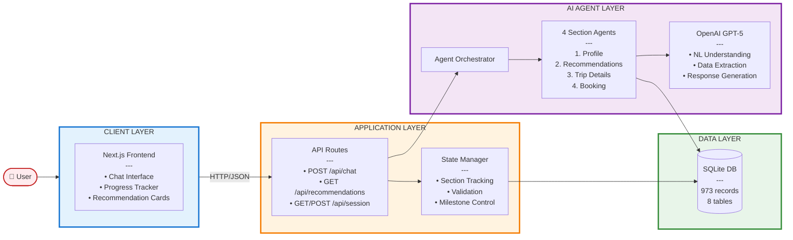
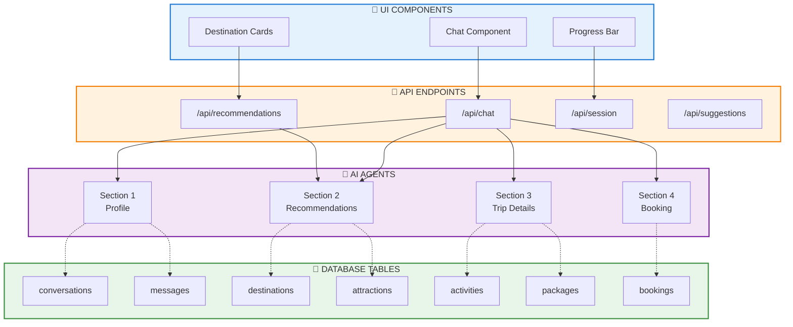
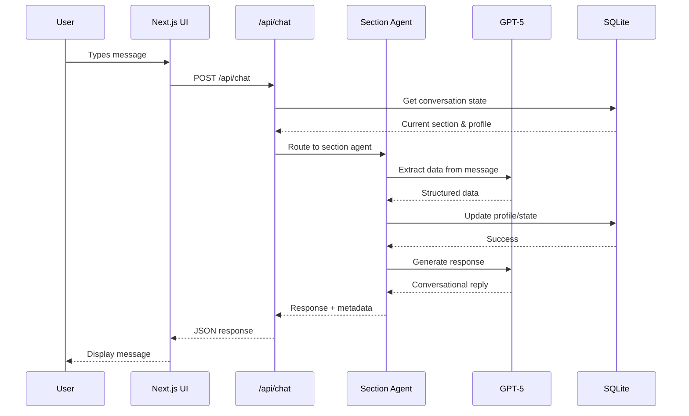
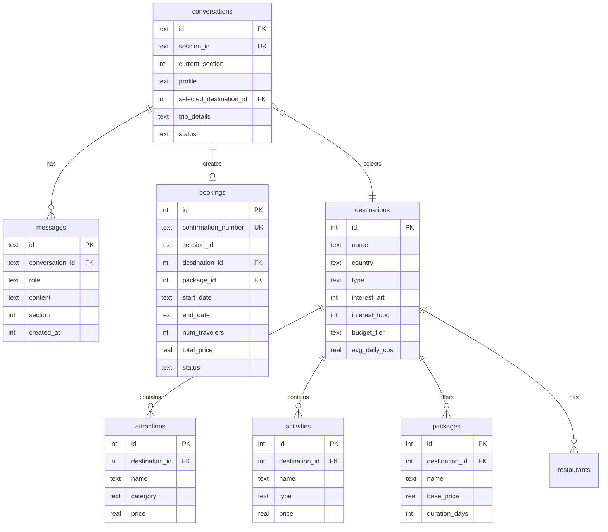

# System Architecture Diagram

## Intelligent Booking Assistant - Technical Architecture

### Architecture Overview (Text)

```
┌─────────────────────────────────────────────────────────────────┐
│                         👤 USER                                 │
└────────────────────────────┬────────────────────────────────────┘
                             │
                             ↓
┌─────────────────────────────────────────────────────────────────┐
│                   🎨 CLIENT LAYER                               │
│  ┌───────────────────────────────────────────────────────────┐  │
│  │  Next.js Frontend (React + TypeScript + TailwindCSS)     │  │
│  │  • Chat Interface (message input/output)                 │  │
│  │  • Progress Tracker (Section 1-4 indicator)              │  │
│  │  • Recommendation Cards (destination display)            │  │
│  └───────────────────────────────────────────────────────────┘  │
└────────────────────────────┬────────────────────────────────────┘
                             │ HTTP/JSON
                             ↓
┌─────────────────────────────────────────────────────────────────┐
│                   ⚙️  APPLICATION LAYER                          │
│  ┌───────────────────────────────────────────────────────────┐  │
│  │  API Routes (Next.js)                                     │  │
│  │  • POST /api/chat         → Main conversation handler    │  │
│  │  • GET  /api/recommendations → Fetch destinations        │  │
│  │  • POST /api/session      → Session management           │  │
│  │  • POST /api/suggestions  → Dynamic suggestions          │  │
│  └───────────────────────────────────────────────────────────┘  │
│  ┌───────────────────────────────────────────────────────────┐  │
│  │  State Manager                                            │  │
│  │  • Get/Create Conversation                                │  │
│  │  • Track Current Section (1-4)                            │  │
│  │  • Validate Milestone Completion                          │  │
│  │  • Advance to Next Section                                │  │
│  └───────────────────────────────────────────────────────────┘  │
└────────────────────────────┬────────────────────────────────────┘
                             │
                             ↓
┌─────────────────────────────────────────────────────────────────┐
│                   🤖 AI AGENT LAYER                             │
│  ┌───────────────────────────────────────────────────────────┐  │
│  │  Agent Orchestrator (Routes to Section Agent)            │  │
│  └───────────────────────────────────────────────────────────┘  │
│  ┌───────────────────────────────────────────────────────────┐  │
│  │  Section Agents                                           │  │
│  │  1. Profile Agent       → Extract user preferences       │  │
│  │  2. Recommendation Agent→ Match destinations             │  │
│  │  3. Trip Agent          → Finalize dates/activities      │  │
│  │  4. Booking Agent       → Create booking                 │  │
│  └───────────────────────────────────────────────────────────┘  │
│  ┌───────────────────────────────────────────────────────────┐  │
│  │  OpenAI GPT-5                                             │  │
│  │  • Natural Language Understanding                         │  │
│  │  • Structured Data Extraction                             │  │
│  │  • Response Generation                                    │  │
│  └───────────────────────────────────────────────────────────┘  │
└────────────────────────────┬────────────────────────────────────┘
                             │
                             ↓
┌─────────────────────────────────────────────────────────────────┐
│                   💾 DATA LAYER                                 │
│  ┌───────────────────────────────────────────────────────────┐  │
│  │  SQLite Database (database.db) - 973 records             │  │
│  │                                                           │  │
│  │  📋 Session Tables                                        │  │
│  │  • conversations  → Session state, current section       │  │
│  │  • messages       → Chat history                         │  │
│  │                                                           │  │
│  │  🌍 Content Tables                                        │  │
│  │  • destinations   → 37 cities with interest scores       │  │
│  │  • attractions    → 320 tourist attractions              │  │
│  │  • activities     → 320 tours and experiences            │  │
│  │  • packages       → 56 pre-built travel packages         │  │
│  │  • restaurants    → 240 dining options                   │  │
│  │                                                           │  │
│  │  📝 Booking Table                                         │  │
│  │  • bookings       → Confirmed booking records            │  │
│  └───────────────────────────────────────────────────────────┘  │
└─────────────────────────────────────────────────────────────────┘
```

### High-Level System Architecture



### Detailed Component Architecture



### Data Flow Sequence



## Component Descriptions

### Client Layer
- **Next.js Frontend**: React components with TailwindCSS styling
- **Chat Interface**: Message input/output with streaming responses
- **Progress Tracker**: Visual indicator of current section (1-4) and completion %
- **Recommendation Cards**: Interactive cards displaying destination options

### Application Layer
- **API Routes**: RESTful endpoints handling client requests
  - `/api/chat`: Main conversational endpoint using GPT-5
  - `/api/recommendations`: Fetch personalized destination matches
  - `/api/session`: Initialize or retrieve user session
  - `/api/suggestions`: Dynamic context-aware suggestions

- **State Manager**: Orchestrates conversation flow
  - Tracks current section (1-4)
  - Manages milestone completion
  - Advances users through sections
  - Persists state to database

### AI Agent Layer
- **Agent Orchestrator**: Routes requests to appropriate section agent
- **Section Agents**: Specialized handlers for each milestone
  - **Profile Agent**: Extracts preferences (interests, budget, group type, etc.)
  - **Recommendation Agent**: Matches user profile to destinations using scoring algorithm
  - **Trip Agent**: Collects dates, activities, packages
  - **Booking Agent**: Generates summary and creates booking

- **GPT-5 Integration**: 
  - Structured data extraction from natural language
  - Conversational response generation
  - Field validation and completeness checking

### Data Layer (SQLite)
- **conversations**: Session state and current progress
- **messages**: Full conversation history
- **destinations**: 37 European cities with interest scores
- **attractions**: 320 tourist attractions
- **activities**: 320 tours and experiences
- **packages**: 56 pre-built travel packages
- **restaurants**: 240 dining options
- **bookings**: Confirmed booking records

### Database Schema



## Technology Stack

| Layer | Technology | Purpose |
|-------|-----------|---------|
| Frontend | Next.js 14 (App Router) | Server-side rendering, routing |
| UI | React + TypeScript | Component-based UI |
| Styling | TailwindCSS | Responsive design |
| Backend | Next.js API Routes | RESTful API endpoints |
| Database | SQLite + better-sqlite3 | Local persistent storage |
| AI | OpenAI GPT-5 | Natural language understanding |
| Session | iron-session | Secure session management |
| Validation | Zod | Schema validation |

## Data Flow Example

1. **User sends message**: "I want art and food in Europe"
2. **Chat API** receives POST to `/api/chat`
3. **State Manager** retrieves current section (Section 1)
4. **Orchestrator** routes to Profile Agent
5. **Profile Agent** calls GPT-5 to extract: `interests: ['art', 'food']`
6. **Database** updates conversation profile
7. **Profile Agent** validates completeness (still missing budget, duration, etc.)
8. **GPT-5** generates response: "Great! What's your budget range?"
9. **Response** streamed back to client
10. **UI** displays agent message in chat

## Scalability & Performance

### Current Optimizations
- **SQLite WAL Mode**: Better concurrency for read/write operations
- **Prepared Statements**: Reusable SQL queries for performance
- **Transaction Batching**: Multiple operations in single transaction
- **Session Caching**: Active sessions kept in memory
- **Index Optimization**: Indexes on frequently queried columns

### Production Considerations
- **Database**: Migrate to Turso (hosted SQLite) for serverless deployment
- **Caching**: Add Redis for LLM response caching
- **Monitoring**: Vercel Analytics + Sentry for error tracking
- **Rate Limiting**: 100 req/min per IP, 30 LLM calls/min per session

