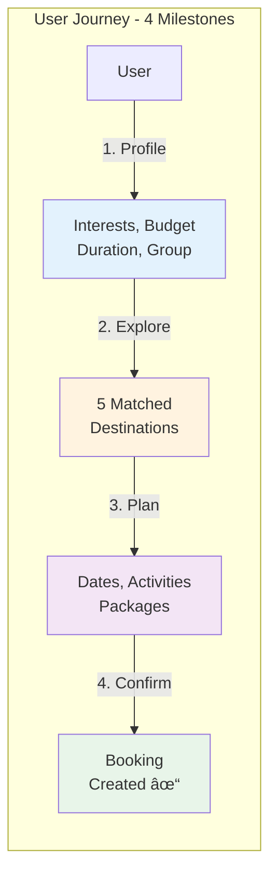

# User Flow - Intelligent Booking Assistant

**Product & UX Documentation**

---

## Table of Contents

1. [Overview](#overview)
2. [Complete User Journey](#complete-user-journey)
3. [The 4-Section Flow](#the-4-section-flow)
4. [Section Details](#section-details)
5. [State Transitions](#state-transitions)
6. [Message Flow Examples](#message-flow-examples)
7. [Error Handling](#error-handling)
8. [Conversion Optimization](#conversion-optimization)

---

## Overview

The Intelligent Booking Assistant guides users through a structured 4-section booking process using conversational AI. Each section has clear objectives, validation gates, and advancement triggers.

### User Journey Stages



**Typical Timeline:**
- **Fast Path:** 2-3 minutes (quick booker with clear preferences)
- **Average:** 12-15 minutes (exploratory user, compares options)
- **Thorough:** 20-25 minutes (detailed research, modifications)

---

## Complete User Journey

### Process Flow Diagram


---

## The 4-Section Flow

### Progress Overview

| Section | Goal | Average Time | Completion Rate |
|---------|------|--------------|-----------------|
| 1ï¸âƒ£ Profile | Extract preferences | 3-8 min | ~95% |
| 2ï¸âƒ£ Destination | Match & select | 4-15 min | ~85% |
| 3ï¸âƒ£ Trip Details | Finalize plans | 3-10 min | ~90% |
| 4ï¸âƒ£ Confirmation | Create booking | 2-5 min | ~98% |

**Progress Indicators:**
- Visual progress bar: 0% → 25% → 50% → 75% → 100%
- Section status: ○ Pending | ⟳ In Progress | ✓ Complete
- Field checklist: Shows collected vs. missing data

---

## Section Details

### 🎯 Section 1: Profile Gathering (25% Complete)

**Objective:** Extract complete user profile through natural conversation

**Required Information (8 fields):**

| Field | Options | Example |
|-------|---------|---------|
| **Interests** | art, food, nature, adventure, nightlife, shopping, history, relaxation | ["art", "food"] |
| **Budget** | budget, moderate, luxury | "moderate" |
| **Group Type** | solo, couple, family, group | "couple" |
| **Group Size** | 1-20 people | 2 |
| **Duration** | 2-30 days | 4 |
| **Travel Season** | spring, summer, fall, winter | "summer" |
| **Pace** | relaxed, moderate, fast | "relaxed" |
| **Weather** | warm, mild, cool, any | "warm" |

**AI Behavior:**
- Extracts fields from natural language using GPT-5
- Validates completeness after each message
- Generates clarifying questions for missing fields
- Shows progress checklist in journey sidebar
- Allows modifications at any time

**Example Conversation:**

```
Agent: Welcome! I'm here to help you plan your perfect European getaway. 
       Tell me about your travel interests and what you're looking for!

User: We're a couple interested in art museums and good food

Agent: Wonderful! Art and food - you'll love what Europe has to offer. 
       
       ✓ Interests: Art, Food
       ✓ Group: Couple (2 people)
       
       A few more details to personalize your recommendations:
       • What's your approximate budget per person?
       • How many days are you planning to travel?

User: Mid-range budget, around 4-5 days next June

Agent: Perfect! Let me confirm what I have so far:
       
       ✓ Interests: Art, Food
       ✓ Budget: Moderate
       ✓ Group: Couple (2 people)
       ✓ Duration: 4-5 days
       ✓ Season: Summer (June)
       
       Just one more question: Do you prefer a relaxed pace or 
       like to pack in lots of activities?

User: Relaxed for sure

Agent: Excellent! ✓ Your profile is complete!
       
       Ready to see your personalized destination recommendations?

[User signals advancement: "Yes, show me destinations"]
→ Section 1 Complete → Advance to Section 2
```

**Validation Gate:** All 8 required fields must be populated

**Advancement Triggers:**
- User says: "I'm ready", "show me destinations", "find cities", "yes"
- System confirms profile completeness

---

### 🌠Section 2: Destination Exploration (50% Complete)

**Objective:** Match user to perfect destination and get explicit selection

**Process:**
1. Query 37 destinations from database
2. Calculate match scores using algorithm
3. Present top 5 with reasons and highlights
4. Allow exploratory Q&A
5. Detect selection intent
6. Confirm and advance

**Match Score Breakdown:**
```
Total Score (0-100) = 
  Interest Match (40%) +
  Budget Fit (25%) +
  Season Match (15%) +
  Pace Alignment (20%)
```

**Example Recommendations:**

```
Agent: Based on your profile, here are my top 5 recommendations:

🥇 Amsterdam (95% match)
   The perfect blend of world-class art museums and exceptional food scene.
   Home to the Rijksmuseum and Van Gogh Museum, plus 23 Michelin-starred 
   restaurants.
   
   ✓ Perfect match for art (95/100), food (80/100)
   ✓ Fits your moderate budget (€120/day)
   ✓ Ideal for summer travel
   ✓ Great for relaxed pace (85/100)
   
   Estimated budget: €800-1100 for 4 days

🥈 Florence (92% match)
   Renaissance art capital with incredible Tuscan cuisine.
   The Uffizi Gallery, Accademia, and authentic Italian trattorias.
   
   ✓ Art score: 98/100, Food: 95/100
   ✓ Budget: €115/day (moderate)
   ✓ Perfect summer destination
   
   Estimated budget: €700-1000 for 4 days

🥉 Paris (89% match)
   Art, food, and culture in the City of Light...

[Continue with 4th and 5th recommendations]

Which destination interests you most? I can tell you more about any of them!
```

**Exploratory Conversation:**

```
User: Tell me more about Amsterdam hotels

Agent: Great question! For your moderate budget and relaxed pace, 
       I recommend staying in the Museumkwartier area:
       
       🨠Hotel Recommendations:
       • Hotel Okura (4-star) - €180/night
         Walking distance to major museums
       • Conservatorium Hotel (luxury boutique) - €250/night
         Former music conservatory, near museums
       • Hotel Fita (3-star) - €130/night
         Budget-friendly, clean, great location
       
       All include breakfast and are near art museums and restaurants.

User: What about the food scene?

Agent: Amsterdam's food scene is fantastic for your interests!
       
       ðŸ½ï¸ Highlights:
       • 23 Michelin-starred restaurants
       • Albert Cuyp Market - street food paradise
       • De Pijp neighborhood - trendy restaurants
       • Indonesian cuisine (colonial heritage)
       • Canal-side dining experiences
       
       Recommended restaurants:
       • De Librije (3-star Michelin) - fine dining
       • The Duchess - Art Deco brasserie
       • Restaurant Johannes - local & seasonal
       
       Would you like to book Amsterdam?

User: Yes, I want to book Amsterdam

Agent: Excellent choice! Amsterdam is perfect for art and food lovers.
       
       ✓ Destination confirmed: Amsterdam (95% match)
       
       Let's plan the details of your trip!

→ Section 2 Complete → Advance to Section 3
```

**Validation Gate:** User must explicitly select one destination

**Selection Detection:** Keywords like "book", "choose", "select", "go with", "I want" + city name

**Advancement Trigger:** Valid destination selection confirmed

---

### 📅 Section 3: Trip Finalization (75% Complete)

**Objective:** Collect all specific booking details

**Information Gathered:**

| Item | Details | Required |
|------|---------|----------|
| **Dates** | Start date, end date | ✅ Yes |
| **Times** | Arrival time, departure time | ✅ Yes |
| **Accommodation** | Package OR custom hotel | ✅ Yes (one) |
| **Activities** | Tours, experiences | ✅ Min 1 |
| **Attractions** | Museums, landmarks | ✅ Min 2 |
| **Special Requests** | Dietary, accessibility, etc. | ⌠Optional |

**Example Conversation:**

```
Agent: Great! Let's finalize your Amsterdam trip.
       
       What are your exact travel dates?

User: June 15-19, arriving around 2pm

Agent: Perfect! June 15-19 (4 nights) ✓
       Arrival: Afternoon ✓
       
       Now, let me show you some package options that match your interests:
       
       📦 Amsterdam Cultural Package - €899/person
          ✓ 4 nights at Hotel Museumkwartier (4-star)
          ✓ Rijksmuseum entry
          ✓ Van Gogh Museum entry
          ✓ Canal cruise
          ✓ Breakfast included
          
          Total for 2: €1,798
       
       📦 Art & Food Lover Package - €1,099/person
          ✓ 4 nights at Conservatorium Hotel (5-star)
          ✓ Museum passes (3 museums)
          ✓ Jordaan food tour
          ✓ Private canal cruise
          ✓ Breakfast included
          
          Total for 2: €2,198
       
       Which package interests you? Or would you like to customize?

User: The cultural package looks great, but can I add the food tour?

Agent: Absolutely! Adding Jordaan food tour (+€85/person)
       
       📋 Your Trip Summary:
       ✓ Amsterdam Cultural Package (€899 × 2)
       ✓ Jordaan Food Tour (€85 × 2)
       
       Total: €1,968 for 2 travelers
       
       This is within your moderate budget! ✓
       
       Any other activities or special requests?

User: That's perfect! Ready to review

Agent: Excellent! Let me prepare your complete booking summary.

→ Section 3 Complete → Advance to Section 4
```

**Budget Validation:**
- Calculate running total as selections are made
- Warn at 80% of stated budget
- Show alternatives if exceeding budget
- Allow modifications

**Validation Gate:**
- Valid future dates
- End date after start date
- Accommodation selected (package or custom)
- Minimum activities/attractions met

**Advancement Trigger:** User says "ready to review", "looks good", "proceed", "confirm"

---

### ✅ Section 4: Review & Confirmation (100% Complete)

**Objective:** Final review and booking creation

**Process:**
1. Generate complete trip summary
2. Allow modifications (back navigation)
3. Collect contact information
4. Final confirmation prompt
5. Create booking record
6. Generate confirmation number
7. Display success message

**Example Conversation:**

```
Agent: Here's your complete Amsterdam trip summary:
       
       â•â•â•â•â•â•â•â•â•â•â•â•â•â•â•â•â•â•â•â•â•â•â•â•â•â•â•â•â•â•â•â•â•â•â•â•â•â•â•â•â•â•â•â•â•â•â•
       🎨 AMSTERDAM CULTURAL GETAWAY
       â•â•â•â•â•â•â•â•â•â•â•â•â•â•â•â•â•â•â•â•â•â•â•â•â•â•â•â•â•â•â•â•â•â•â•â•â•â•â•â•â•â•â•â•â•â•â•
       
       📅 DATES
       June 15-19, 2025 (4 nights)
       Arrival: Afternoon, Departure: Morning
       
       👥 TRAVELERS
       2 Adults (Couple)
       
       🨠ACCOMMODATION
       Hotel Museumkwartier (4-star)
       4 nights with breakfast
       
       🎭 ACTIVITIES & ATTRACTIONS
       ✓ Rijksmuseum - Renaissance art
       ✓ Van Gogh Museum - Post-impressionist collection
       ✓ Canal cruise - 1 hour tour
       ✓ Jordaan Food Tour - 3-hour walking tour
       
       💰 PRICING
       Cultural Package:        €1,798
       Jordaan Food Tour:       €  170
       ───────────────────────────────
       Total:                   €1,968
       
       â•â•â•â•â•â•â•â•â•â•â•â•â•â•â•â•â•â•â•â•â•â•â•â•â•â•â•â•â•â•â•â•â•â•â•â•â•â•â•â•â•â•â•â•â•â•â•
       
       Everything look good? I'll need your contact information to confirm.

User: Looks perfect!

Agent: Great! To complete your booking, please provide:
       • Email address
       • Phone number

User: john.smith@email.com, +1-555-123-4567

Agent: Thank you! Let me confirm those details:
       
       📧 Email: john.smith@email.com
       📱 Phone: +1-555-123-4567
       
       Ready to confirm your booking?

User: Yes, confirm it

Agent: 🎉 Booking Confirmed!
       
       â•â•â•â•â•â•â•â•â•â•â•â•â•â•â•â•â•â•â•â•â•â•â•â•â•â•â•â•â•â•â•â•â•â•â•â•â•â•â•â•
       Your confirmation number: BOOK-2025-00147
       â•â•â•â•â•â•â•â•â•â•â•â•â•â•â•â•â•â•â•â•â•â•â•â•â•â•â•â•â•â•â•â•â•â•â•â•â•â•â•â•
       
       A confirmation email has been sent to john.smith@email.com
       
       What's Next:
       ✓ Check your email for full itinerary
       ✓ Booking vouchers will arrive 7 days before travel
       ✓ Hotel will contact you directly
       
       Have an amazing trip to Amsterdam! 🇳🇱

→ Section 4 Complete → Booking Created → Journey Complete!
```

**Contact Validation:**
- Email format validated
- Phone format validated
- Optional emergency contact

**Validation Gate:**
- Valid email provided
- Valid phone provided
- User explicitly confirms

**Completion Actions:**
- Create booking record in database
- Generate unique confirmation number (BOOK-YYYY-NNNNN)
- Log completion
- Display success state

---

## State Transitions

### Section Advancement Matrix

| From Section | To Section | Trigger | Validation Required |
|--------------|------------|---------|-------------------|
| 0 (Initial) | 1 | Session start | None |
| 1 | 2 | User intent + complete profile | All 8 profile fields populated |
| 2 | 3 | Destination selected | Selected destination ID stored |
| 3 | 4 | Trip details finalized | Dates, times, accommodation, min activities |
| 4 | Complete | Booking confirmed | Contact info + explicit confirmation |
| Any | Previous | User requests modification | None (always allowed) |

### Allowing Modifications

Users can navigate back to any previous section at any time:

```
User: Actually, can I change the destination?

Agent: Of course! Which section would you like to modify?
       1. Your profile (interests, budget, etc.)
       2. Destination choice
       3. Trip details (dates, activities)

User: The destination

Agent: [Returns to Section 2, preserves other data]
```

---

## Message Flow Examples

### Happy Path (12 minutes total)

**Timeline: Section 1 (3 min)**
```
0:00 - User lands on site
0:05 - "We're a couple who love art and food, mid-budget, 4 days in June"
0:20 - GPT-5 extracts: couple (2), art/food interests, moderate budget, 4 days, summer
0:25 - Agent asks: "Do you prefer a relaxed pace?"
0:40 - User: "Relaxed"
0:50 - Agent: "✓ Profile complete. Ready for recommendations?"
1:00 - User: "Yes"
→ Section 1 Complete (25%)
```

**Timeline: Section 2 (4 min)**
```
1:05 - Agent shows 5 destinations with scores
1:30 - User: "Tell me about Amsterdam hotels"
2:00 - Agent provides hotel recommendations
2:20 - User: "What about the food scene?"
2:50 - Agent details food options
3:30 - User: "Perfect, book Amsterdam"
4:00 - Agent: "✓ Amsterdam confirmed. Let's plan details!"
→ Section 2 Complete (50%)
```

**Timeline: Section 3 (3 min)**
```
4:05 - Agent: "What are your exact dates?"
4:20 - User: "June 15-19, arriving at 2pm"
4:40 - Agent shows packages
5:10 - User: "Cultural package plus food tour"
5:40 - Agent: "Total €1,968. Ready to review?"
6:00 - User: "Yes"
→ Section 3 Complete (75%)
```

**Timeline: Section 4 (2 min)**
```
6:05 - Agent displays complete summary
6:30 - User: "Looks perfect!"
6:40 - Agent: "Email and phone?"
7:00 - User provides contact info
7:20 - Agent: "Confirm booking?"
7:30 - User: "Yes"
7:40 - Agent: "🎉 Confirmed! BOOK-2025-00147"
→ Section 4 Complete (100%)
```

**Total Time: ~8 minutes (fast booker)**

---

### Exploratory Path (22 minutes)

Users who ask many questions, compare options, and modify selections:

```
Section 1: 5 min (asks clarifying questions)
Section 2: 12 min (compares 3 destinations, asks detailed questions)
Section 3: 4 min (modifies package selection)
Section 4: 1 min (quick confirmation)
Total: 22 minutes
```

---

## Error Handling

### Validation Failures

**Invalid Dates:**
```
User: June 40th to 45th

Agent: I notice those dates aren't valid. June only has 30 days.
       Could you provide your travel dates? For example: June 15-19
```

**Over Budget:**
```
Agent: âš ï¸ Budget Alert
       Your selections total €2,500, which is above your stated budget of €2,000.
       
       Would you like to:
       • Remove the spa package (-€300)
       • Choose a 3-star hotel instead (-€400)
       • Proceed anyway
```

**Incomplete Profile:**
```
User: Show me destinations

Agent: I'd love to! But I need a bit more information first:
       
       â—‹ Budget range (still needed)
       â—‹ Travel duration (still needed)
       
       What's your approximate budget per person?
```

**Invalid Email:**
```
User: My email is john@emailcom

Agent: That email format doesn't look quite right. 
       Could you double-check? It should be something like: name@domain.com
```

---

### User Corrections

**Modifying Previous Sections:**

```
User: Actually, I want to change my budget to luxury

Agent: No problem! Updating your budget to luxury.
       
       Would you like me to refresh the destination recommendations 
       based on this change?

User: Yes please

[Agent recalculates and shows new recommendations]
```

**Changing Destination Mid-Flow:**

```
User: Can I switch to Paris instead?

Agent: Of course! Let me update your selection to Paris.
       
       The trip details we collected (June 15-19) will still apply.
       Let me show you Paris packages that match your interests...

[Continues from Section 3 with new destination]
```

---

### System Errors

**GPT-5 Failure:**
```
System: [Retry 3 times with exponential backoff]
If still failing: "I'm having trouble processing that right now. 
                  Could you try rephrasing?"
```

**Database Error:**
```
System: "We're experiencing technical difficulties. 
         Your progress has been saved. Please try again in a moment."
[Log error for debugging]
```

---

## Conversion Optimization

### Critical Success Factors

**Section 1 (95% target completion):**
- ✅ Minimize questions needed (target: 3-5 exchanges)
- ✅ Extract multiple fields per message
- ✅ Show progress checklist for transparency
- ✅ Allow skipping optional fields

**Section 2 (85% target completion):**
- ✅ Present highest match score first
- ✅ Show compelling highlights for top 3
- ✅ Allow easy exploration without pressure
- ✅ Make selection intent obvious

**Section 3 (90% target completion):**
- ✅ Pre-select most popular package
- ✅ Show clear pricing breakdown
- ✅ Warn before going over budget
- ✅ Minimize required inputs

**Section 4 (98% target completion):**
- ✅ Clear, concise summary
- ✅ Single-click confirmation
- ✅ Reduce friction at final step
- ✅ Build confidence with details

### Abandonment Recovery

**State Persistence:**
- Every message saves current state
- Users can close browser and return
- Progress bar shows where they left off

**Recovery Strategy:**
```
User returns after 24 hours

Agent: Welcome back! I saved your progress.
       
       ✓ Section 1: Complete (profile saved)
       ✓ Section 2: Amsterdam selected
       â—‹ Section 3: In progress (dates needed)
       
       Ready to continue planning your Amsterdam trip?
```

**Drop-off Tracking:**
Monitor where users abandon:
- Section 1: Track which fields cause drop-off
- Section 2: Track if users explore but don't select
- Section 3: Track budget concerns
- Section 4: Track confirmation hesitation

---

## UI Progress Indicators

### Visual Elements

**Horizontal Progress Bar (Header):**
```
[1] ─────◠[2] ───── [3] ───── [4]
25%    Current
```

**Section Status Icons:**
- â—‹ **Pending** - Gray circle
- ⟳ **In Progress** - Blue spinning circle
- ✓ **Complete** - Green checkmark

**Journey Sidebar:**
```
┌─────────────────────────â”
│ Your Journey            │
│ 🔵 Section 2 Active     │
├─────────────────────────┤
│ ✓ 1. Preferences        │
│   • Art, Food           │
│   • Moderate budget     │
│   • Couple (2)          │
│   • 4 days              │
├─────────────────────────┤
│ 🔵 2. Destination       │
│   📠Amsterdam          │
│   95% match             │
├─────────────────────────┤
│ ○ 3. Trip Details       │
├─────────────────────────┤
│ ○ 4. Confirmation       │
└─────────────────────────┘
```

---

## Success Metrics

### Target Metrics (Product)

| Metric | Target | Measurement |
|--------|--------|-------------|
| Section 1 Completion | > 90% | Users who complete profile |
| Section 2 Selection Rate | > 85% | Users who select destination |
| Section 3 Completion | > 90% | Users who finalize details |
| End-to-End Conversion | > 25% | Start → Booking complete |
| Average Booking Time | < 15 min | Median time to complete |
| Drop-off Rate | < 20% | Users who abandon |
| User Satisfaction | > 4.5/5 | Post-booking survey |

### Tracking Points

**Key Events to Log:**
1. Section start (1-4)
2. Section complete (1-4)
3. Field extraction (profile fields)
4. Destination explored (which cities)
5. Destination selected
6. Package selected
7. Budget exceeded
8. Modification requested
9. Booking created
10. User drop-off (which section)

---

**For technical implementation, see:** [SYSTEM-ARCHITECTURE.md](./SYSTEM-ARCHITECTURE.md)
